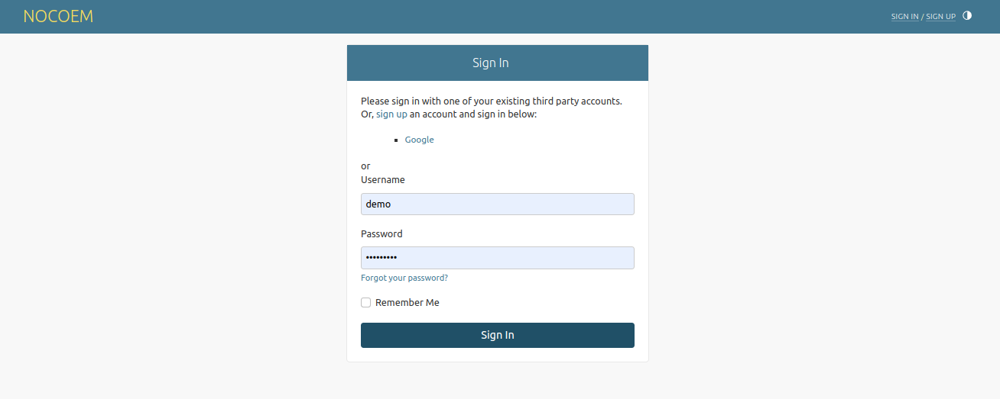

# Django AllAuth Simple UI



UI templates for [django-allauth](https://github.com/pennersr/django-allauth)


## Simple usage

1. Install by running the following command
 ```bash
 pip install django-allauth-simple-ui
 ```

2. Add the following settings to your `settings.py` file
 ```python
 INSTALLED_APPS = [
     'allauth_ui',
     'allauth',
     # etc
 ]
 
 # example custom for accounts settings 
ALLAUTH_UI = dict(
    LOGIN_URL="/login/",
    LOGIN_REDIRECT_URL="/",
    LOGOUT_REDIRECT_URL="/",
)
 ```

3. Add the account URLs to your `urls.py` file
 ```python
from django.urls import path, include

urlpatterns = [
    path('', include("allauth_ui.urls")),
]
 ```